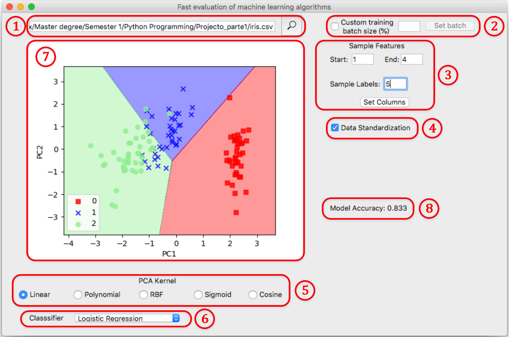

# Fast-evaluation-of-ML-models-performance

The motivation behind this work is to get some intuition on what machine learning model we can use  to get the best possible outcome out of our datasets. Until now, there are five  main components of this project: The Visual intepretation of our model once dimensionality reduction is applied. The data dimensionality reduction using PCA-Kernels. Data standardization for highly disperse datasets. The use of six different classifiers and the performance metrics section.

